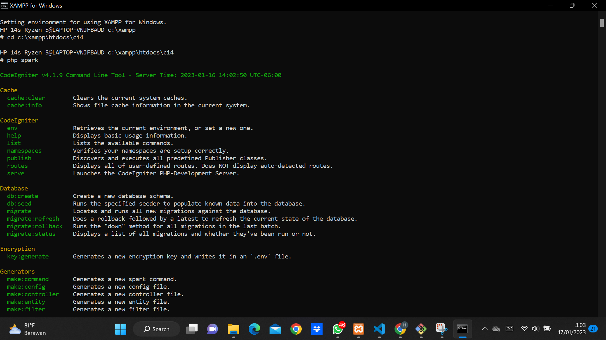
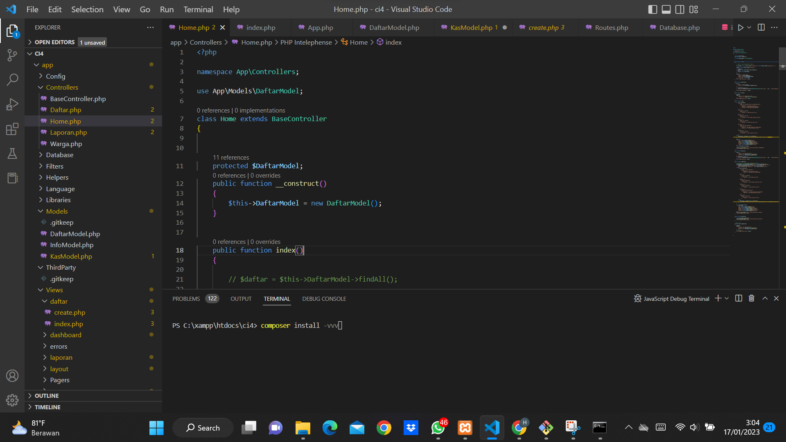
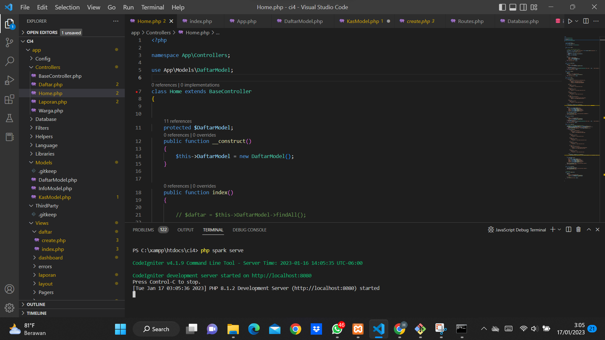
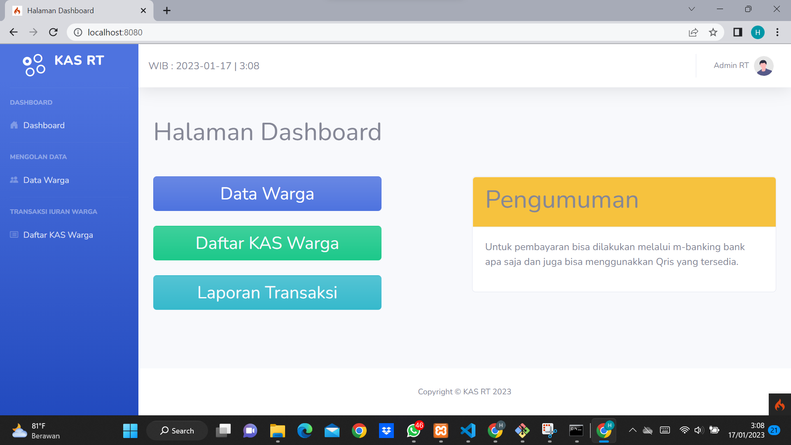
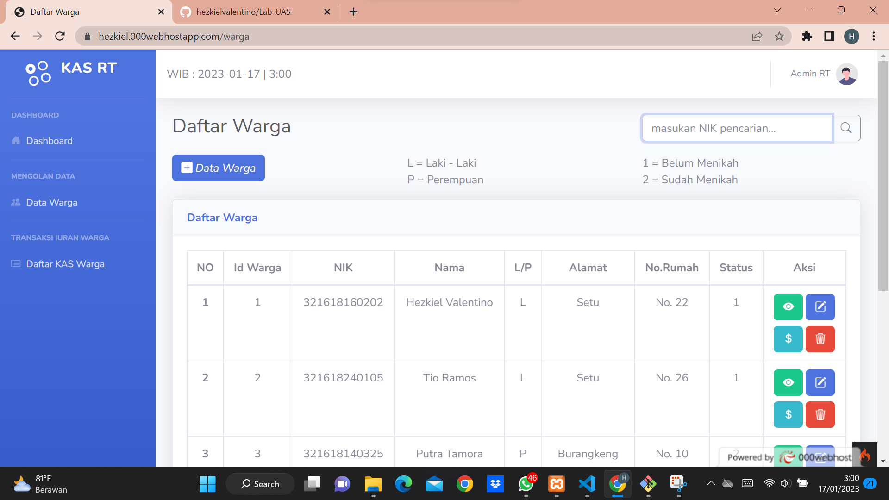
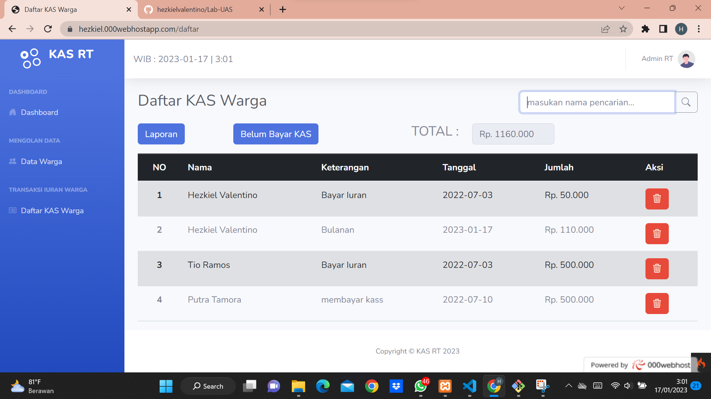
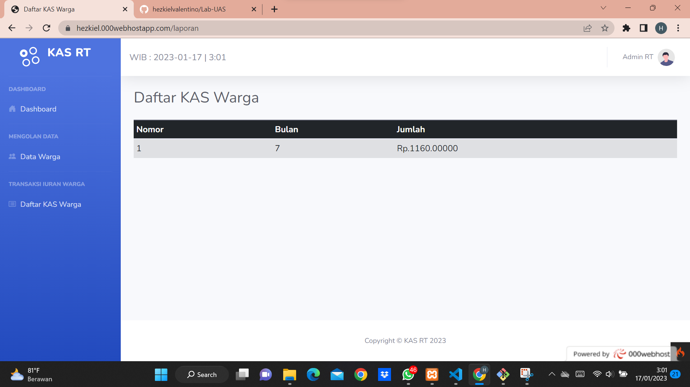

# Lab-UAS
## Download File

https://github.com/hezkielvalentino/Lab-UAS.git

## Lakukan `php spark` pada shell XAMPP

Akses folder yang sudah di download sebelumnya dan pindahkan pada folder xampp htdocs

`cd c:\xampp\htdocs\ci4\`

## Download telebih dahulu Composer dan install pada folder yang sudah di download dengan VS Code terminal

## Lakukan `php spark serve` pada terminal yang sebelumnya

## Setelah itu akses pada web browser

http://localhost:8080/

## Hasil Tampilan pada WEB yang sudah dibuat

## <a href="https://hezkiel.000webhostapp.com/">Program Demo</a>
## <a href="https://www.youtube.com/watch?v=a1IClm2RzO4">Video Penjelasan</a>